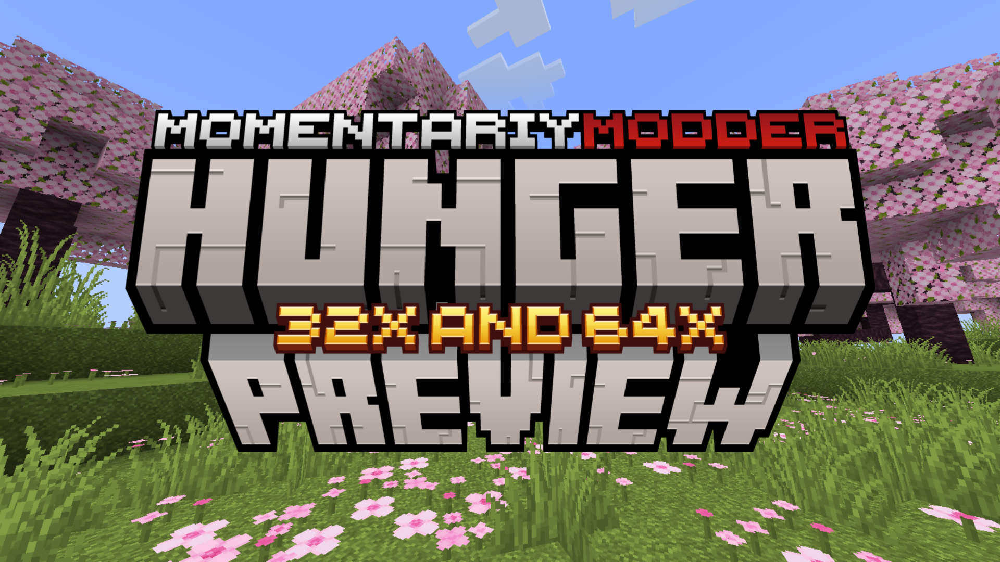

    

<b align="center">It allows you to know how much hunger will be quenched, as well as its saturation. You can find out this information by hovering over an item in any Inventory.</b>

<table><tbody>
    <tr>
        <td colspan="4"><h3 align="center">Latest Released</h3></td>
    </tr>
    <tr>
        <td><h4 align="center">MC Version</h4></td>
        <td colspan="2"><h4 align="center">Download</h4></td>
		<td><h4 align="center">Status</h4></td>
    </tr>
	<tr>
        <td>
<b>1.21</b>
</td>
        <td>
<a href="https://github.com/MomentariyModder/HungerPreview/raw/main/files/1.21/32x.zip">32x</a>
</td>
		<td>
<a href="https://github.com/MomentariyModder/HungerPreview/raw/main/files/1.21/64x.zip">64x</a>
</td>
        <td>
Active
</td>
    </tr>
	<tr>
        <td>
<b>1.20.6</b>
</td>
        <td>
<a href="https://github.com/MomentariyModder/HungerPreview/raw/main/files/1.20.6/32x.zip">32x</a>
</td>
		<td>
<a href="https://github.com/MomentariyModder/HungerPreview/raw/main/files/1.20.6/64x.zip">64x</a>
</td>
        <td>
End of Life
</td>
    </tr>
	<tr>
        <td>
<b>1.20.4</b>
</td>
        <td>
<a href="https://github.com/MomentariyModder/HungerPreview/raw/main/files/1.20.4/32x.zip">32x</a>
</td>
		<td>
<a href="https://github.com/MomentariyModder/HungerPreview/raw/main/files/1.20.4/64x.zip">64x</a>
</td>
        <td>
End of Life
</td>
    </tr>
	<tr>
        <td>
<b>1.20.1</b>
</td>
        <td>
<a href="https://github.com/MomentariyModder/HungerPreview/raw/main/files/1.20.1/32x.zip">32x</a>
</td>
		<td>
<a href="https://github.com/MomentariyModder/HungerPreview/raw/main/files/1.20.1/64x.zip">64x</a>
</td>
        <td>
End of Life
</td>
    </tr>
	<tr>
        <td>
<b>1.19.2</b>
</td>
        <td>
<a href="https://github.com/MomentariyModder/HungerPreview/raw/main/files/1.19.2/32x.zip">32x</a>
</td>
		<td>
<a href="https://github.com/MomentariyModder/HungerPreview/raw/main/files/1.19.2/64x.zip">64x</a>
</td>
        <td>
End of Life
</td>
    </tr></tbody>
</table>

